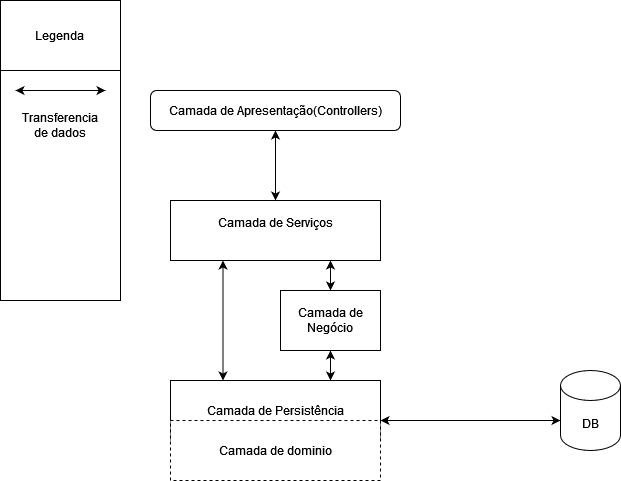

# ploomes-teste

Teste prático do projeto da ploomes, consiste em uma API RESTful cujo objetivo dessa API é permitir a avaliação de lugares ao redor do mundo com base em sua localização através de coordenadas de longitude e latitude. Além disso, também é possível cadastrar novos lugares utilizando o CNPJ.

Os usuários têm a opção de se cadastrar como avaliadores ou proprietários, e os avaliadores podem encontrar os lugares mais próximos com base em sua própria localização. No entanto, para realizar avaliações, é necessário fazer login como avaliador.

Ao fazer uma avaliação, os usuários podem atribuir notas decimais de 0.0 a 5.0 para os seguintes aspectos:

- Ambiente do lugar
- Preço do lugar
- Qualidade do serviço ou produtos oferecidos
- Atendimento do estabelecimento

Existe também a opção de realizar uma avaliação anônima, onde o nome do avaliador não será exibido.

A avaliação poderá ser atualizada, e guardará o histórico de notas e descrição.

Os usuários não logados têm acesso limitado às informações dos lugares e avaliações disponíveis.

Utiliza Entity Framework Core 6,AutoMapper e o Framework Identity Core para autenticar os usuários.

### Arquitetura utilizada

 

